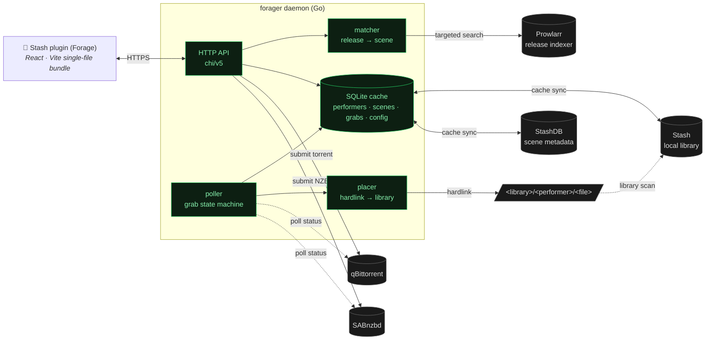
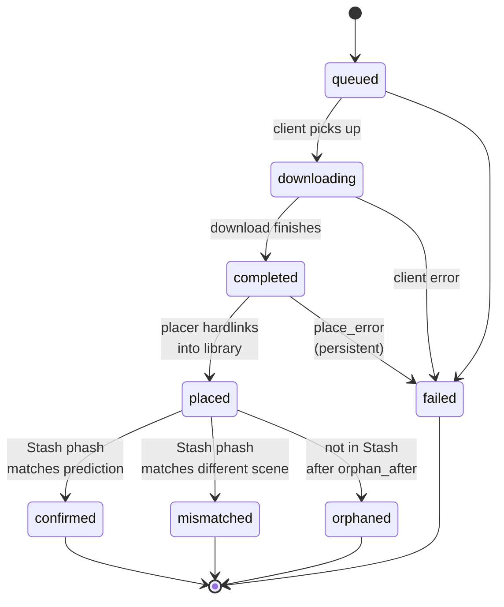

# forager

**Performer-driven scene grabbing for Stash.**

A backend daemon (Go) + Stash plugin (React) that lets you browse a performer's StashDB filmography against your local library, find releases for the gaps, grab them via qBittorrent or SABnzbd, and have the finished files dropped into a per-performer folder structure — without the arr-stack's import-orchestration fragility.



## The problem this solves

Whisparr's release-matcher works backwards from what arbitrary release names look like: it tries to parse "Vixen.22.05.31.Hazel.Moore.XXX.1080p..." into title/performer/studio/date fields. That fails constantly because release names don't conform to a grammar.

Forager inverts the approach. It knows what's in your library (performers, studios via StashDB cross-IDs) and projects those *known entities* onto release strings. Tokenization handles CamelCase, digit-splits, and stopword filtering; three-phase Prowlarr queries break through the per-indexer 50-result cap; post-download Stash phash matching confirms (or contradicts) the prediction.

## How it works

| Stage | What forager does |
|---|---|
| **Browse** | Plugin shows your performers, sortable by `last_release` / `missing_count` / etc. Click a performer → see every scene on StashDB you don't have. |
| **Search** | Click a missing scene → forager queries Prowlarr via three progressive phases (broad performer → performer + studio → scene-title) for releases that could be that scene. |
| **Match** | Each release goes through the tokenized matcher against your library's known performers + studios. Releases are scored 0..1 and the UI shows them banded by confidence (`conf-1`..`conf-5`) with a colour-coded left-stripe. |
| **Grab** | Click Grab → forager submits the release to qBit (torrents) or SAB (NZBs) with a forager-specific category. |
| **Place** | Poller watches the download client. When the file finishes, forager hardlinks it into `<library_root>/<performer>/` (or copies if cross-device). The original stays in the staging dir so torrents keep seeding. |
| **Confirm** | Once Stash scans the placed file, the daemon matches its phash against StashDB and labels the grab `confirmed` / `mismatched` / `orphaned` so the UI surfaces failures. |
| **Discover** | A 12h background job pulls every performer's full StashDB filmography → caches the recent-90-day window → renders a Discover view with personalized scenes + the global StashDB trending list (refreshed hourly). |

## Prerequisites

- **Stash** with an API key (any modern version; tested against 0.31)
- **StashDB account** + API key (the daemon pulls scene metadata; needed to compute "missing scenes")
- **Prowlarr** for release discovery (optional — daemon boots without it, but search 503s)
- **qBittorrent** + **SABnzbd** as desired (optional — grabs route by `release.protocol`)
- A **library directory** writable by the daemon, on the same filesystem as your download clients' staging dir (so hardlinks work — falls back to copy if cross-device)

## Install — daemon

### 1. Copy and edit `.env`

```bash
cp .env.example .env
```

Fill in the values for `FORAGER_STASH_URL`, `FORAGER_STASH_API_KEY`, `FORAGER_STASHDB_API_KEY`. Everything else is optional — they can be filled in from the plugin's Settings panel post-launch.

Set `FORAGER_LIBRARY_ROOT` to the directory you want forager to drop placed files into. **This path is inside the container** — make sure the volume mount in compose puts the real host directory there.

### 2. Wire volumes in `docker-compose.yml`

See `docker-compose.example.yml` for a template. The pattern is: bind-mount one filesystem at a single in-container path, and have qBit/SAB's complete-downloads directory + the library directory both live inside that mount. That way hardlinking is a metadata-only operation.

Typical layout (in-container):

```
/data/media/downloads/complete/   ← qBit + SAB write here
/data/media/library/              ← forager hardlinks here; Stash scans this
```

Both come from the same host bind-mount (or NAS share).

### 3. Configure the download-client categories

In **qBittorrent**: create a category called `forager` (or whatever you set `FORAGER_QBIT_CATEGORY` to) with `save_path = /data/downloads/complete` (or wherever inside the container your staging lives).

In **SABnzbd**: add a category `forager` with `dir = /data/media/downloads/complete`.

The category save paths must point at the *staging* dir, not directly at the library. The placer hardlinks staging → library.

### 4. Bring it up

```bash
docker compose up -d --build
docker logs forager     # confirm all clients reach
```

You should see:

```
forager starting version=...
stash reachable version=v0.31.x
stashdb reachable user=...
prowlarr reachable version=...
qbit reachable version=... category=forager
sab reachable version=... category=forager
placer configured library_root=/data/media/library
daemon configured via env / config.json
listening addr=0.0.0.0:7979
```

### 5. (Optional) expose over HTTPS

If your Stash UI is HTTPS, browsers refuse to call HTTP endpoints from it (mixed-content). Use Tailscale Serve, a Cloudflare Tunnel, or a reverse proxy to put forager behind HTTPS. The compose template includes a Tailscale sidecar pattern as an example.

## Install — Stash plugin

The plugin lives in `plugin/`. To deploy:

```bash
cd plugin
npm install
npm run build
# Copy these three files into Stash's plugin directory:
#   forage.yml  dist/forage.entry.js  dist/index.html
```

The exact plugin path is per-platform — on Stash's defaults it's something like `<stash-config>/plugins/forage/`. Reload plugins in Stash → the Forage tab appears.

Open it, click the gear → set "Forager API URL" to your daemon's URL (e.g. `http://forager.example.com:7979` or your Tailscale Serve URL).

## Features

### Performer-driven discovery

The plugin's **Performers** tab is your library, sortable four ways:

- **Owned scene count** — default; biggest local presence first
- **Name** — alphabetical
- **Last release** — newest StashDB scene first (great for "who's been busy lately?")
- **Missing scenes** — biggest gap between StashDB's filmography and your library (great for "who's most worth time?")

Click a performer → **Missing scenes**. Click a missing scene → **Releases**, with confidence-banded Grab buttons.

### Discover view

A separate tab showing scenes from StashDB you don't own, refreshed every 12h. Two sections:

- **Trending on StashDB** — the global trending list (top 50), in a 5-card carousel with chevron pagination. Refreshes every 1h. Hover any performer chip for a popover with the performer's image + library stats.
- **From your performers** — every recent scene (last 7/30/60/90 days, your choice) featuring any of your library performers that you don't already own.

Hovering performer chips on scene cards shows an instant popover with image, favourite badge, library count, StashDB count, missing count, and last release date.

### Grabs view

Live tracker for every grab you've submitted. Status totals chip-strip at the top — click any to filter by state. Expand a row for the full timeline + reason + placed path + StashDB scene cross-id.



Auto-polls every 5 seconds when there are non-terminal grabs in flight; slows to 30 seconds when everything's settled. When `FORAGER_LIBRARY_ROOT` is unset, `completed` transitions directly to `confirmed` / `mismatched` / `orphaned` (placer skipped — files stay in the download client's complete dir).

### Placement

Forager owns final file placement (a deliberate choice — the arr-stack's "tag at client, sort-via-arr" flow has too many failure points). When a download finishes:

1. Source path is read from qBit's `content_path` or SAB's history `path`
2. Forager builds `<library_root>/<sanitized-performer-name>/<release-filename>`
3. `os.Link` is attempted (cheap, instant, keeps torrents seedable). If the source is on a different filesystem, falls back to a streamed copy.
4. The grab row's status flips to `placed`, then once Stash scans the new file, to `confirmed` / `mismatched` / `orphaned`.

The performer-folder name comes from whichever performer page the user grabbed from — predictable, no "primary performer" heuristics.

### In-app configuration

Every credential and connection setting is editable from the plugin's Settings panel — `.env` becomes a *bootstrap* path for first-run, but the UI overrides it from then on. Save creates `./data/config.json`; the daemon hot-swaps every client on save (no restart). Each section has a `Test` button that probes connectivity before persisting.

Failed probes return 422; the UI offers a "Force save" override if you know what you're doing. Sensitive fields are masked in the API response — the UI shows `••••••` until the user types a new value.

## Configuration reference

| Var | Default | Purpose |
|---|---|---|
| `FORAGER_LISTEN_ADDR` | `127.0.0.1:7979` | HTTP bind address |
| `FORAGER_DB_PATH` | `forager.db` | SQLite path (config.json lives next to it) |
| `FORAGER_STASH_URL` | _required_ | Local Stash URL |
| `FORAGER_STASH_API_KEY` | _required_ | Stash API key |
| `FORAGER_STASHDB_URL` | `https://stashdb.org` | StashDB endpoint (`.org`, not `.cc`) |
| `FORAGER_STASHDB_API_KEY` | _required_ | StashDB API key |
| `FORAGER_PROWLARR_URL` | _empty_ | Prowlarr URL (search 503s if unset) |
| `FORAGER_PROWLARR_API_KEY` | _empty_ | Prowlarr API key |
| `FORAGER_PROWLARR_CATEGORIES` | `6000,6010,6020,6030,6040` | XXX-cat list for Prowlarr queries |
| `FORAGER_QBIT_URL` | _empty_ | qBit URL (torrent /grab 503s if unset) |
| `FORAGER_QBIT_USERNAME` | _empty_ | optional; blank if `bypass_local_auth` on |
| `FORAGER_QBIT_PASSWORD` | _empty_ | optional |
| `FORAGER_QBIT_CATEGORY` | `forager` | must exist in qBit; save_path = staging dir |
| `FORAGER_SAB_URL` | _empty_ | SAB URL (usenet /grab 503s if unset) |
| `FORAGER_SAB_API_KEY` | _empty_ | SAB API key |
| `FORAGER_SAB_CATEGORY` | `forager` | must exist in SAB; dir = staging dir |
| `FORAGER_LIBRARY_ROOT` | _empty_ | placement target; same FS as staging for hardlinks |
| `FORAGER_POLL_INTERVAL` | `60s` | how often the grabs poller ticks |
| `FORAGER_ORPHAN_AFTER` | `6h` | how long a grab can be `completed` before being marked `orphaned` |
| `FORAGER_CACHE_REFRESH` | `6h` | performer + studio + scene cache refresh cadence (trending is hardcoded to 1h) |
| `FORAGER_ALLOWED_ORIGIN` | `*` | CORS allowlist; set to your Stash origin to lock down |
| `FORAGER_ADMIN_TOKEN` | _empty_ | optional Bearer token guarding `/config*` |
| `FORAGER_LOG_LEVEL` | `info` | `debug` / `info` / `warn` / `error` |

Values can also be set via the plugin's Settings panel (POST `/config`), which writes `./data/config.json`. JSON overrides env at runtime; env is the fallback. The `GET /config` response shows a `source` per field (`json` / `env` / `default`) so the UI can flag when env is winning.

## Endpoints

| Method | Path | Purpose |
|---|---|---|
| `GET` | `/healthz` | Liveness + per-section configured flags |
| `GET` | `/performers` | Cached performer list. `?sort=`, `?favorite_only=`, `?q=` |
| `GET` | `/missing-scenes?performer=<id>` | StashDB scenes for a performer that aren't in your library |
| `GET` | `/scenes/{id}/releases` | Prowlarr releases for a target StashDB scene, with confidence scores |
| `GET` | `/search?performer=<id>` | SSE stream of releases for a performer (three-phase) |
| `GET` | `/discover` | Recent unowned scenes from your performers + StashDB trending. `?days=`, `?favorite_only=`, `?trending_limit=` |
| `POST` | `/grab` | Submit a release to qBit (`protocol=torrent`) or SAB (`protocol=usenet`) |
| `GET` | `/grabs` | Grab list + status totals. `?status=`, `?limit=`, `?offset=` |
| `POST` | `/refresh` | Force performer + studio cache rebuild |
| `GET` | `/config` | Current config with per-field source + masked secrets |
| `POST` | `/config` | Save config patch; probes changed sections; reloads clients atomically |
| `POST` | `/config/test/{section}` | Probe-only — validate before saving |

All `/config*` routes are gated by `FORAGER_ADMIN_TOKEN` when it's set.

## Dev — run locally

```bash
go run .
```

Without `FORAGER_LIBRARY_ROOT`, placement is skipped (files stay where the download client put them). Without `FORAGER_QBIT_URL` / `FORAGER_SAB_URL`, the matching `/grab` protocol returns 503 but everything else works.

For the plugin:

```bash
cd plugin
npm install
npm run dev      # vite dev server, hot reload
npm run build    # production bundle into dist/
```

In dev, point your browser at `http://localhost:5173/` — the plugin runs standalone (use the Settings panel to point it at your daemon).

## Build (binary)

```bash
go build -trimpath -ldflags "-s -w -X main.Version=v0.1.0" -o forager .
```

CGO is disabled (`modernc.org/sqlite`); the binary is statically linked. The bundled `Dockerfile` uses distroless + a non-root UID and runs in ~25MB.
