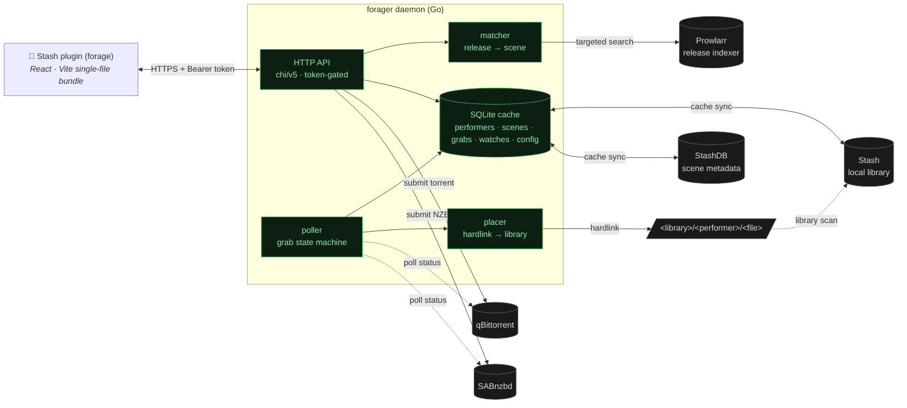
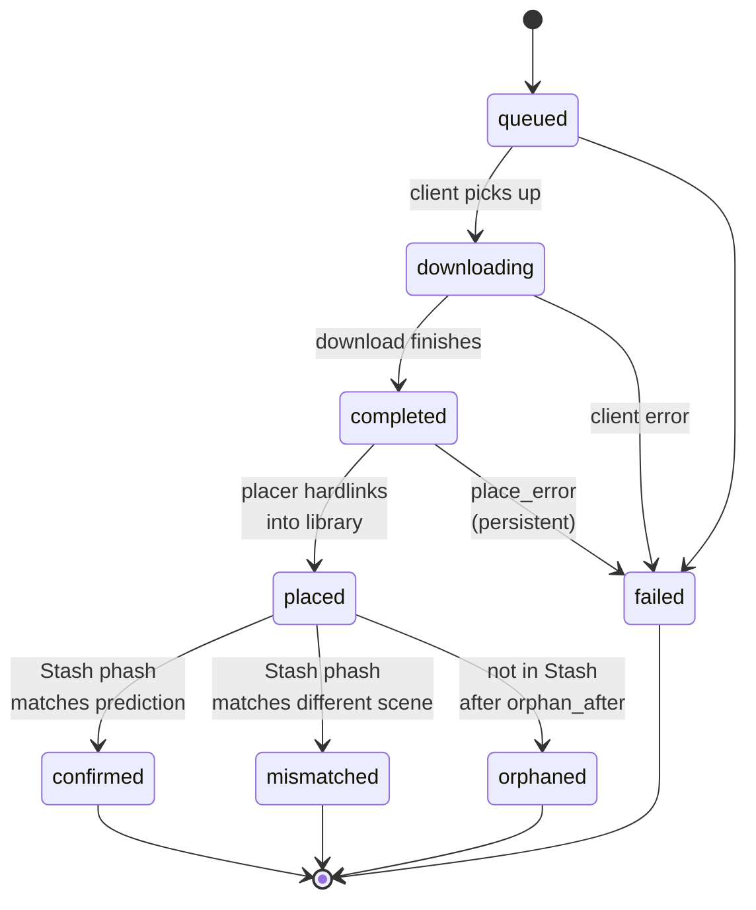

# forage

**Performer-driven scene grabbing for Stash.**

forage is a [Stash](https://stashapp.cc) plugin backed by a small Go daemon. You browse a performer's StashDB filmography against your own library, find releases for the scenes you're missing, grab them through qBittorrent or SABnzbd, and forage drops the finished files into a per-performer folder — then confirms, by perceptual hash, that what landed is actually what you wanted.

> **Naming:** *forage* is the product — the plugin and the experience. *forager* is the daemon that backs it (and the name of this repo, the container, and the `FORAGER_*` environment variables). When you read "forager" below, it's the service; "forage" is the thing you click.



> **Status:** early (v0). The core flow — browse → search → match → grab → place → confirm — is solid and used daily, but some paths (large pack grabs, the watchlist's grab step) are lightly exercised. It's built for a single self-hosted user on a trusted network. See [Security & access](#security--access) before exposing it anywhere.

---

## The problem this solves

Whisparr matches releases *backwards*: it parses an arbitrary release name like `Vixen.22.05.31.Hazel.Moore.XXX.1080p...` into title/performer/studio/date fields, then tries to line those up against what it knows. Release names don't follow a grammar, so that fails constantly.

forage inverts it. It already knows what's in your library — your performers and studios, with their StashDB cross-IDs — and projects those *known entities* onto release strings. Tokenization handles CamelCase, digit-splits, and stopwords; multi-phase Prowlarr queries break through the per-indexer result cap; and after the download lands, Stash's perceptual hash confirms (or contradicts) the prediction, so a wrong match surfaces instead of silently polluting your library.

## How it works

| Stage | What forage does |
|---|---|
| **Browse** | The plugin shows your performers, sortable by owned count, name, last release, or how many scenes you're missing. Pick one → see every StashDB scene for them that you don't already have. |
| **Search** | Pick a missing scene → forager queries Prowlarr for releases that could be it. The interactive search is *lean* (fast); a **Deep search** button runs the full multi-query fan-out when you want a wider net. |
| **Match** | Each release runs through the tokenized matcher against your library's known performers + studios, and is scored by a release-quality preference list you control (resolution + indexer source). The UI bands them verified / unverified, ranked by your score. |
| **Grab** | Click Grab → forager submits the release to qBittorrent (torrents) or SABnzbd (NZBs) under a forage-specific category. |
| **Place** | When the download finishes, forager hardlinks it into `<library_root>/<performer>/` (copying only if it's on a different filesystem). The original stays put, so torrents keep seeding. |
| **Confirm** | After Stash scans the placed file, forager matches its phash against StashDB and labels the grab `confirmed` / `mismatched` / `orphaned`, so failures are visible rather than silent. |
| **Watch** | No release yet? Track the scene at a target quality. A background loop re-searches on a cadence spread over 24h and tells you when a matching release appears — you decide whether to grab it. It never grabs on its own. |

---

## Features

### Performer-driven discovery

The **Performers** tab is your library, sortable four ways:

- **Owned scene count** — biggest local presence first (default).
- **Name** — alphabetical.
- **Last release** — newest StashDB scene first ("who's been busy lately?").
- **Missing scenes** — biggest gap between StashDB's filmography and your library ("who's most worth my time?").

Pick a performer → **Missing scenes**. Pick a scene → **Releases**, with confidence-banded, quality-ranked Grab buttons. You can also multi-select scenes and hand the batch to a collection job (below), or hit **Complete collection** to sweep everything they're missing.

### Discover

A tab of scenes you don't own, refreshed on the cache cadence:

- **Trending on StashDB** — the global trending list, refreshed hourly, in a paginated carousel.
- **From your performers** — recent scenes (last 7/30/60/90 days, your choice) featuring any of your library performers that you don't already have.

Hovering a performer chip pops a card with their image, favourite badge, library count, StashDB count, missing count, and last release date.

### Watching (the watchlist)

The one piece of automation that fits: **notify, never auto-grab.**

Hit **Track ▾** on any scene card and pick a target — *any quality*, *720p*, *1080p*, or *4k* (exact match: a 4K release does **not** satisfy a 1080p watch). A background loop re-searches your watched scenes on a cadence auto-spread over ~24h, using the lean search path so it doesn't hammer Prowlarr. When a verified release at your target quality appears, the watch flips to **available** and stops checking — the **Watching** tab splits into *Available* (one-click Grab) and *Watching* (still looking). Nothing is ever grabbed for you.

### Release search & scoring

Releases are ranked by a preference list you edit in Settings — built from the two things that actually appear in release names for this content: **resolution** and **indexer source**. Each rule adds or subtracts points (e.g. 1080p +100, 4K +70, 720p +30, SD −50), or marks a release rejected. The interactive view defaults to a fast *lean* search; **Deep search** runs the full multi-spelling fan-out across indexers when lean comes up short.

### Packs & collections

forage can discover performer **packs** (multi-scene torrents), grab them, place every file, drive Stash identify across all of them, and **dedup** against scenes you already own — keeping your copy, the pack's copy, or both, your choice. **Collection jobs** run a whole-performer search on the daemon (search only — they never grab), then hydrate into the interactive view for you to review and grab from.

### Grabs

A live tracker for every grab. A status chip-strip up top filters by state; expand a row for the full timeline, reason, placed path, and StashDB cross-id.



Polls every 5s while grabs are in flight, slows to 30s when settled. With `FORAGER_LIBRARY_ROOT` unset, `completed` goes straight to `confirmed`/`mismatched`/`orphaned` (placement skipped — files stay in the client's complete dir).

### Placement

forage owns final file placement — a deliberate choice; the arr-stack's "tag at client, sort-via-arr" handoff has too many failure points. When a download finishes:

1. The source path comes from qBit's `content_path` or SAB's history `path`.
2. forage builds `<library_root>/<sanitised-performer>/<release-filename>` (single files use the basename; packs mirror their tree). Performer names are sanitised and release filenames can't traverse out of the library root.
3. `os.Link` (instant, keeps torrents seedable); falls back to a streamed copy across filesystems.
4. The grab flips to `placed`, then to `confirmed`/`mismatched`/`orphaned` once Stash scans it.

The performer folder is whichever performer page you grabbed from — predictable, no "primary performer" guessing.

### First-run setup

A guided wizard runs on first launch: **Welcome → Connect** (daemon URL, plus an admin token if the daemon requires one, each tested before you continue) **→ Credentials** (Stash + StashDB, shown only if the daemon has no credentials yet) **→ Done**. There's an "advanced settings" escape on every step for Prowlarr / download clients / the rest.

### Security & access

Every API route except `/` (the UI bundle) and `/healthz` (liveness) is gated by an optional **admin token** — a shared secret, like an *arr API key. Set or generate one in **Settings → Security** (or via `FORAGER_ADMIN_TOKEN`); the plugin then sends it as a Bearer token on every request. While no token is set the API is **open to anyone who can reach it**, so:

- Keep forager on a trusted network (Tailscale, LAN). Don't expose it to the internet without a token.
- The token rides in a header, so it's only as private as the transport — put forager behind HTTPS (Tailscale Serve, Cloudflare Tunnel, a reverse proxy). This is also required for the plugin to call it from an HTTPS Stash page (browsers block mixed content).
- Lock `FORAGER_ALLOWED_ORIGIN` to your Stash origin as defense-in-depth.

See [Configuration reference](#configuration-reference) for the token's precedence (UI value overrides env). A lost token can be recovered from `data/config.json` on the daemon host.

### In-app configuration

Every credential and connection setting is editable from the plugin's Settings panel — `.env` is a *bootstrap* path for first run, and the UI overrides it from then on. Saving writes `./data/config.json`; the daemon hot-swaps each client on save (no restart). Each section has a **Test** button that probes connectivity first, and a `source` indicator per field flags when an env value is overriding your saved config. Secrets are masked in the API response (`••••••`) until you type a new value.

---

## Prerequisites

- **Stash** with an API key (any modern version; tested against 0.31).
- **StashDB account** + API key — forage pulls scene metadata to compute "missing scenes."
- **Prowlarr** for release discovery (optional — the daemon boots without it, but search returns 503).
- **qBittorrent** and/or **SABnzbd** (optional — grabs route by the release's protocol).
- A **library directory** writable by the daemon, on the same filesystem as your download clients' complete dir (so hardlinks work — it falls back to copy if cross-device).

## Install — daemon

### 1. Configure `.env`

```bash
cp .env.example .env
```

Fill in `FORAGER_STASH_URL`, `FORAGER_STASH_API_KEY`, and `FORAGER_STASHDB_API_KEY` — everything else can be set from the plugin's Settings later. Set `FORAGER_LIBRARY_ROOT` to where forage should place files (**this path is inside the container** — the compose mount must put your real host directory there).

### 2. Wire volumes

```bash
cp docker-compose.example.yml docker-compose.yml
```

Edit `docker-compose.yml` for your environment (it's gitignored, so your copy stays local). The key pattern: bind-mount one filesystem at a single in-container path, with both the download clients' complete dir and the library dir living inside it, so hardlinking is metadata-only:

```
/data/media/downloads/complete/   ← qBit + SAB write here
/data/media/library/              ← forage hardlinks here; Stash scans this
```

### 3. Download-client categories

Create a category in each client and point its save path at the **staging** dir (not the library — the placer hardlinks staging → library):

- **qBittorrent**: a category (e.g. `forage`) with `save_path = /data/media/downloads/complete`.
- **SABnzbd**: a category (e.g. `forage`) with `dir = /data/media/downloads/complete`.

Set `FORAGER_QBIT_CATEGORY` / `FORAGER_SAB_CATEGORY` to match (the built-in default is `manual`).

### 4. Bring it up

```bash
docker compose up -d --build
docker logs forager     # confirm each client is reached
```

You should see `stash reachable`, `stashdb reachable`, `prowlarr reachable`, `qbit reachable`, `sab reachable`, `placer configured`, and `listening`.

### 5. (Optional) HTTPS

If your Stash UI is HTTPS, browsers refuse to call HTTP endpoints from it (mixed content). Front forager with Tailscale Serve, a Cloudflare Tunnel, or a reverse proxy. The compose template includes a Tailscale sidecar example.

## Install — plugin

```bash
cd plugin
npm install
npm run build
# Copy these three files into Stash's plugin directory (e.g. <stash-config>/plugins/forage/):
#   forage.yml  dist/forage.entry.js  dist/index.html
```

Reload plugins in Stash → the **forage** tab appears. Open it and the first-run wizard walks you through pointing it at your daemon. (Or click the gear → set the daemon URL manually.)

---

## Configuration reference

| Var | Default | Purpose |
|---|---|---|
| `FORAGER_LISTEN_ADDR` | `127.0.0.1:7979` | HTTP bind address |
| `FORAGER_DB_PATH` | `forager.db` | SQLite path (`config.json` lives next to it) |
| `FORAGER_STASH_URL` | _required_ | Local Stash URL |
| `FORAGER_STASH_API_KEY` | _required_ | Stash API key |
| `FORAGER_STASHDB_URL` | `https://stashdb.org` | StashDB endpoint (`.org`, not `.cc`) |
| `FORAGER_STASHDB_API_KEY` | _required_ | StashDB API key |
| `FORAGER_PROWLARR_URL` | _empty_ | Prowlarr URL (search 503s if unset) |
| `FORAGER_PROWLARR_API_KEY` | _empty_ | Prowlarr API key |
| `FORAGER_PROWLARR_CATEGORIES` | `6000,6010,6020,6030,6040` | XXX category list for Prowlarr queries |
| `FORAGER_QBIT_URL` | _empty_ | qBit URL (torrent grab 503s if unset) |
| `FORAGER_QBIT_USERNAME` | _empty_ | optional; blank if `bypass_local_auth` is on |
| `FORAGER_QBIT_PASSWORD` | _empty_ | optional |
| `FORAGER_QBIT_CATEGORY` | `manual` | must exist in qBit; save_path = staging dir |
| `FORAGER_SAB_URL` | _empty_ | SAB URL (usenet grab 503s if unset) |
| `FORAGER_SAB_API_KEY` | _empty_ | SAB API key |
| `FORAGER_SAB_CATEGORY` | `manual` | must exist in SAB; dir = staging dir |
| `FORAGER_LIBRARY_ROOT` | _empty_ | placement target; same filesystem as staging for hardlinks |
| `FORAGER_POLL_INTERVAL` | `60s` | grabs poller cadence |
| `FORAGER_ORPHAN_AFTER` | `6h` | how long a grab may sit `completed` before being marked `orphaned` |
| `FORAGER_CACHE_REFRESH` | `6h` | performer + studio + scene cache refresh cadence (trending is hardcoded to 1h) |
| `FORAGER_ALLOWED_ORIGIN` | `*` | CORS allowlist; set to your Stash origin to lock down |
| `FORAGER_ADMIN_TOKEN` | _empty_ | shared secret gating every route except `/` and `/healthz` |
| `FORAGER_LOG_LEVEL` | `info` | `debug` / `info` / `warn` / `error` |

Any of these can also be set from the plugin's Settings panel, which writes `./data/config.json`. Stored JSON overrides env at runtime; env is the fallback. For the admin token specifically, a non-empty UI value wins over `FORAGER_ADMIN_TOKEN`. `GET /config` reports a `source` per field (`json` / `env` / `default`) so the UI can flag when env is winning.

## Endpoints

All routes except `GET /` and `GET /healthz` require the admin token (as `Authorization: Bearer <token>`) when one is set.

| Method | Path | Purpose |
|---|---|---|
| `GET` | `/healthz` | Liveness, per-section configured flags, `adminAuthRequired` |
| `GET` | `/performers` | Cached performer list. `?sort=`, `?favorite_only=`, `?q=` |
| `GET` | `/missing-scenes?performer=<id>` | StashDB scenes for a performer not in your library |
| `GET` | `/scenes/{id}/releases` | Prowlarr releases for a scene, scored + verified. `?lean=1`, `?p=`, `?alias=` |
| `GET` | `/performers/{id}/packs` | Candidate multi-scene packs for a performer |
| `GET` | `/discover` | Recent unowned scenes + StashDB trending. `?days=`, `?favorite_only=`, `?trending_limit=` |
| `POST` | `/grab` | Submit a release (`protocol=torrent` → qBit, `usenet` → SAB) |
| `POST` | `/grab/torrent` · `/grab/torrent/inspect` | Upload / inspect a `.torrent` file |
| `GET` | `/grabs` · `/grabs/{id}/detail` | Grab list + status totals; per-grab detail |
| `POST` | `/grabs/{id}/match` · `DELETE /grabs/{id}` | Re-match a grab to a scene; remove a grab |
| `POST`/`GET` | `/jobs` · `/jobs/{id}` | Collection jobs: start, list, detail |
| `POST` | `/jobs/{id}/grab` · `DELETE /jobs/{id}` | Grab a candidate from a job; cancel a job |
| `POST`/`GET` | `/watches` | Add / list watches |
| `DELETE` | `/watches/{id}` · `POST /watches/{id}/grab` | Stop watching; grab the found release |
| `POST` | `/refresh` | Force a performer + studio cache rebuild |
| `GET`/`POST` | `/config` · `POST /config/test/{section}` | Read/save config; probe a section before saving |

---

## Dev

```bash
go run .                 # daemon (boots unconfigured; set creds via the plugin or .env)
cd plugin && npm run dev # plugin at http://localhost:5173 — runs standalone, point it at your daemon
```

Without `FORAGER_LIBRARY_ROOT`, placement is skipped. Without `FORAGER_QBIT_URL` / `FORAGER_SAB_URL`, the matching grab protocol returns 503 but everything else works.

## Build

```bash
go build -trimpath -ldflags "-s -w -X main.Version=v0.1.0" -o forager .
```

CGO is disabled (`modernc.org/sqlite`), so the binary is statically linked. The bundled `Dockerfile` is distroless + non-root, ~25MB.

## License

MIT — see [LICENSE](LICENSE).
