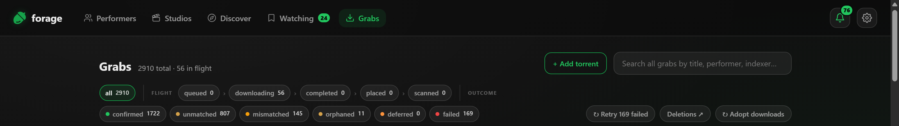
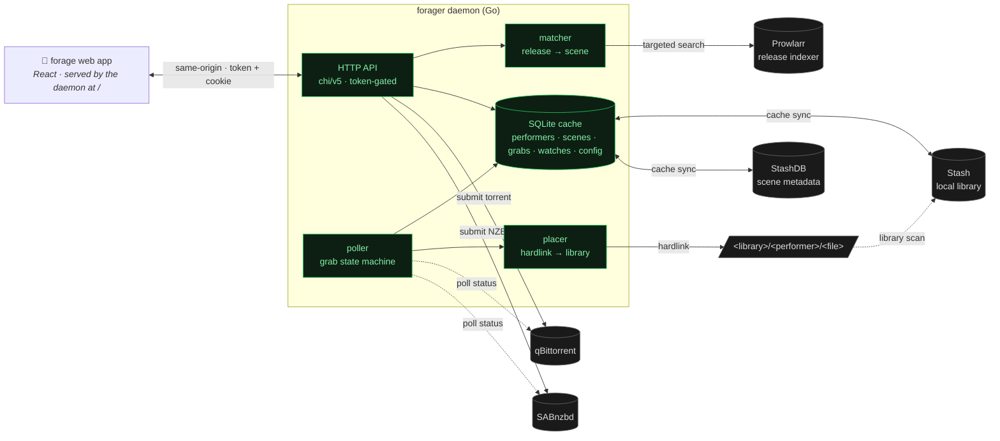
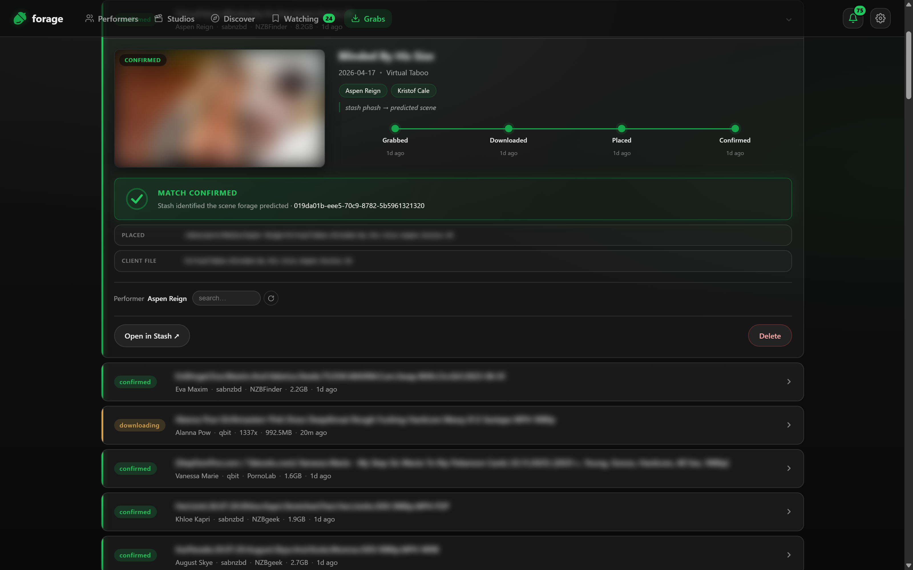
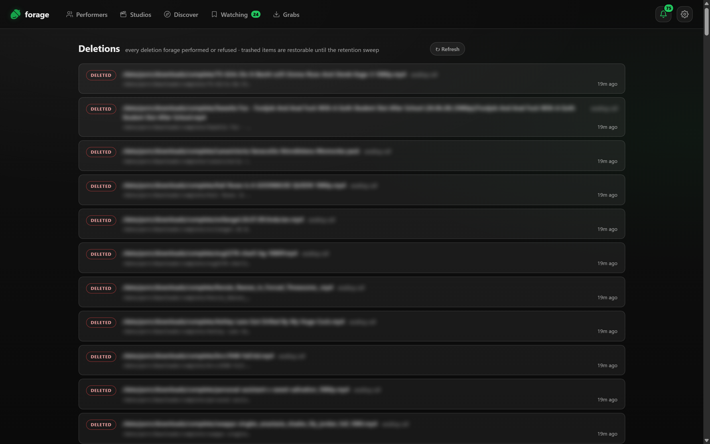
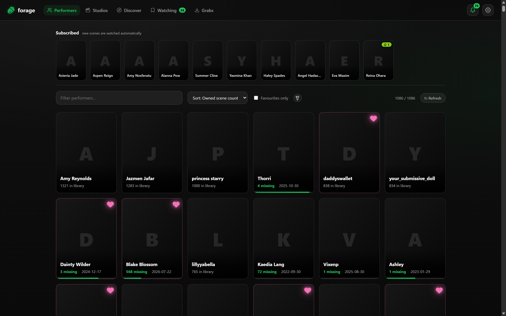
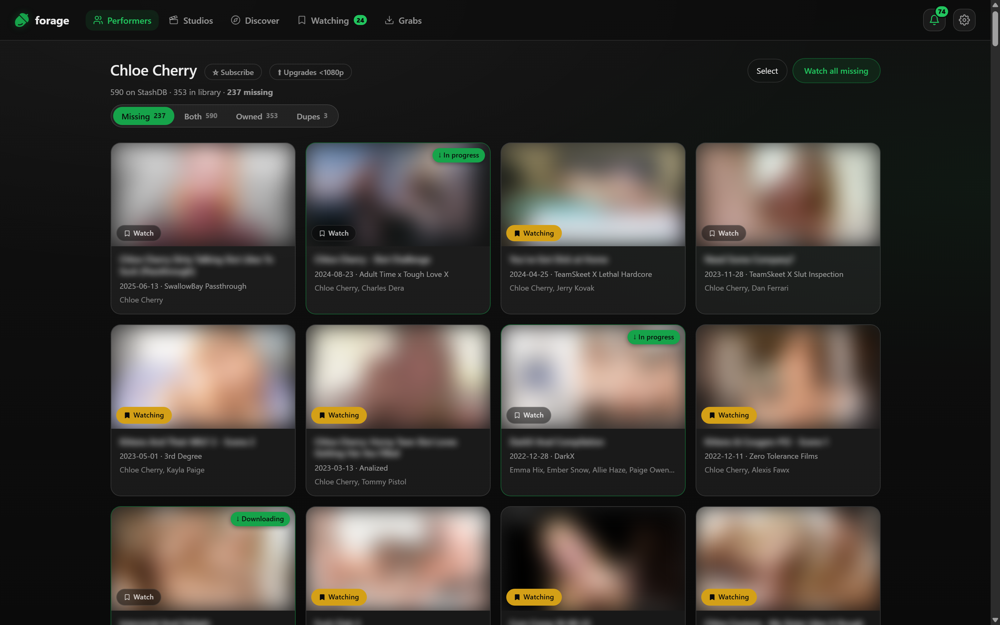
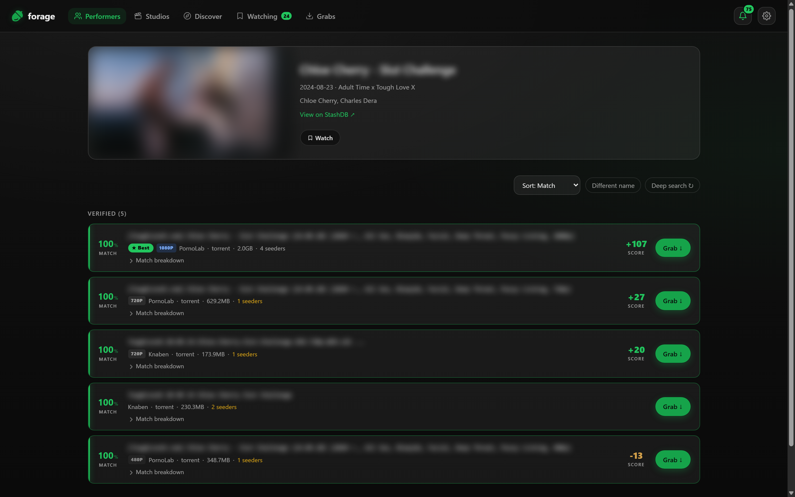
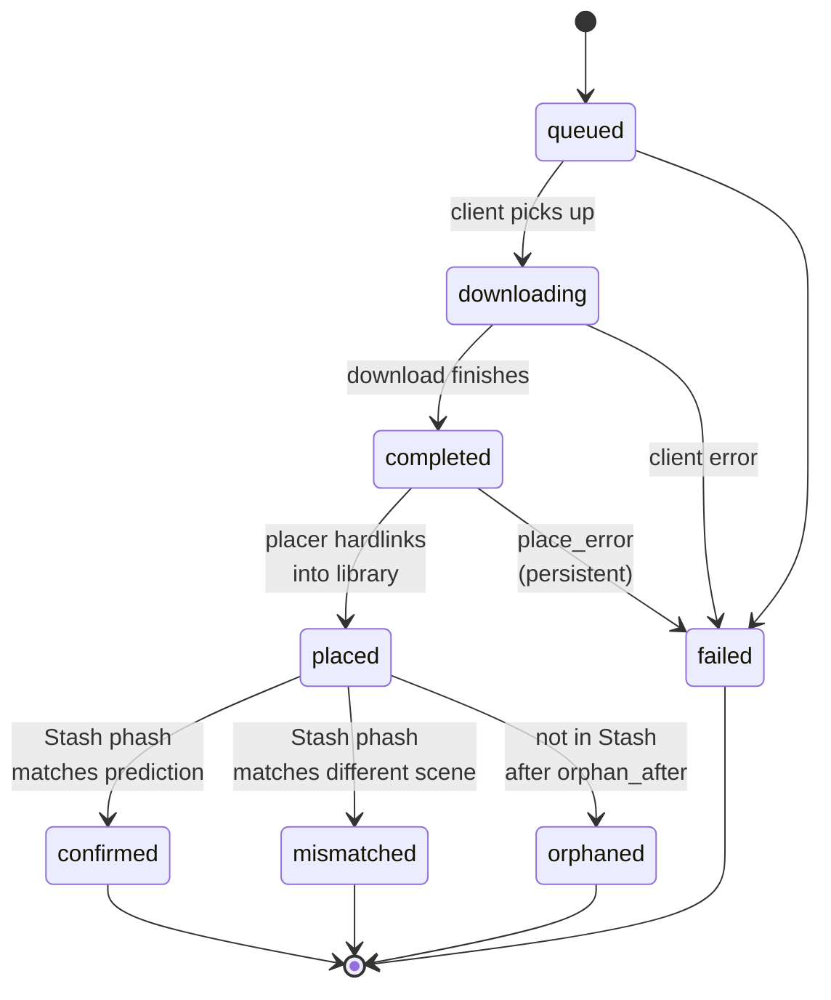

# forage

**It finds the scene, then does the Stash work for you.**

forage is a self-hosted app for [Stash](https://stashapp.cc) users: one binary, no dependencies. Browse a performer's or studio's StashDB filmography against your own library, pick something you're missing, and it goes and finds it — then hardlinks the finished file into the right performer folder, scans it, identifies it against StashDB, generates previews, and checks by perceptual hash that what landed is what you asked for.

Two things it does differently:

**Finding.** Most tools read the release name and hope it parses into title/performer/studio/date. Release names have no grammar, so that fails constantly. forage identifies a release from *evidence* instead — the performers and studios it knows from your library, every plausible reading of the date, scene codes, title tokens, and how much of the candidate scene's real StashDB cast is named. Two independent search tracks gather candidates and five signals score them, so nothing rests on a single clue. Names that would be ambiguous in your library disable themselves, so a one-word performer can't fire on someone else's release.

**Finishing.** The download lands and there's nothing left for you to do in Stash. No manual rescan, no hunting for why a scene didn't identify, no adding the performer by hand, no missing previews. If forage's prediction and Stash's hash disagree, it tells you, with both scene ids, instead of quietly polluting your library.

The daemon serves the app at its own URL (like an *arr); an optional Stash plugin adds a launcher button to Stash's navbar.



> **Naming:** *forage* is the product — the app and the experience. *forager* is the daemon that backs it (and the name of this repo, the container, and the `FORAGER_*` environment variables). When you read "forager" below, it's the service; "forage" is the thing you open.



> **Status:** early (v0), and looking for testers. The core loop — browse → search → match → grab → place → confirm — runs daily against a library of a few thousand scenes, but it has had exactly one user, so expect to be the first person to hit whatever breaks next. Some paths (large pack grabs, the watchlist's grab step) are lightly exercised. It's built for a single self-hosted user on a trusted network — see [Security & access](#security--access) before exposing it anywhere. Bug reports are the most useful thing you can send.

---

## How it works

| Stage | What forage does |
|---|---|
| **Browse** | The plugin shows your performers, sortable by owned count, name, last release, or how many scenes you're missing. Pick one → see every StashDB scene for them that you don't already have. |
| **Search** | Pick a missing scene → forager queries Prowlarr for releases that could be it. The interactive search is *lean* (fast); a **Deep search** button runs the full multi-query fan-out when you want a wider net. |
| **Match** | Each release runs through the tokenized matcher against your library's known performers + studios, and is scored by a release-quality preference list you control (resolution + indexer source). The UI bands them verified / unverified, ranked by your score. |
| **Grab** | Click Grab → forager submits the release to qBittorrent (torrents) or SABnzbd (NZBs) under a forage-specific category. |
| **Place** | When the download finishes, forager hardlinks it into `<library_root>/<performer>/` (copying only if it's on a different filesystem). The original stays put, so torrents keep seeding. |
| **Confirm** | After Stash scans the placed file, forager matches its phash against StashDB and labels the grab `confirmed` / `mismatched` / `orphaned`, so failures are visible rather than silent. |
| **Watch** | No release yet? Track the scene at a target quality. A background loop re-searches on a cadence spread over 24h and tells you when a matching release appears — you decide whether to grab it. It never grabs on its own. |

## How the matching works

A name-parser reads the label on the box. forage works out what's in the box from evidence. Given one release string:

1. **Tokenize.** Fold accents (`Renée` → `renee`, because release names strip them), decompose fullwidth characters (JAV titles use `ＳＴＡＲＳ－６２９`), then split on punctuation and on case/digit boundaries. Both your library's names and the release string go through the same function, which is what makes them comparable — `SNOS-233`, `snos233` and `SNOS.233` all land on the same tokens.
2. **Recognise entities.** Find performers and studios from your library inside those tokens, matched as exact contiguous token runs. Any name that's ambiguous *anywhere in your corpus* switches itself off, so `Cherry` never fires on the wrong person and single-word studio names stay usable.
3. **Extract dates** — every plausible reading, because `26.07.10` is three different dates.
4. **Extract scene codes** — JAV identifiers normalised to canonical form.
5. **Gather candidates on two tracks, in parallel.** Track A fires several structured StashDB queries: performer+studio, one per date reading, plus a performer-only broad fallback (StashDB often files a scene under a sub-studio, and an exact studio AND would silently miss it). Track B runs a full-text search on the tokens. A failure in one doesn't discard the others' candidates.
6. **Score on five independent signals** — performer overlap, studio, date proximity, title overlap, and how many of the candidate scene's *actual StashDB cast* the release names. Anything found by both tracks gets a corroboration bonus.
7. **Verify** through a separate gate, not a score threshold, including a date veto that disqualifies a candidate whose date is confidently far off however well it scored.
8. **Filter the lookalikes** — multi-scene packs, image sets and streaming-link spam all score well precisely because they're related to the scene, so they're explicitly un-verified.

Then the file lands and Stash's perceptual hash checks the answer independently.

## What happens after the grab

This is the half that saves the most time day to day.



| | |
|---|---|
| **Placement** | Hardlinked into `<library>/<performer>/` — the performer page you grabbed from, no "primary performer" guessing. The original stays put, so torrents keep seeding and no space is duplicated. |
| **Scan** | Only the placed path is scanned, not your whole library. |
| **Identify** | Fired against your configured stash-box, retried until the cross-id lands, because Stash's job queue is serial and can run it much later. |
| **Generate** | Previews and sprites, queued *after* identify so they can't block it. |
| **Tagging** | Pack grabs get their performer added to every scene in the pack, additively — identified scenes keep the performers they already had. |
| **Verify** | Stash's phash result is compared to what forage predicted before downloading. Agreement → `confirmed`. Disagreement → `mismatched`, showing both scene ids. |
| **Repair** | If something never matched, one click writes the StashDB scene onto it: cross-id, title, date, studio, performers linked to your local ones, and the cover art Stash couldn't fetch without a hash match. |

## Deleting things without fear

Destruction is where media managers earn distrust, so forage treats it as a
first-class subsystem rather than a button:

- **Every delete shows its plan first.** Arming the Delete button fetches
  the exact file list the purge will execute — full paths, what the
  download client loses, and equally what will *not* be deleted and why
  (e.g. a scene holding a second file another grab placed is refused, not
  destroyed).
- **Trash, not unlink.** Deletions move files to a trash beside the library
  (same filesystem — a free rename, and hardlinks mean zero extra space
  while the torrent still seeds) and stay restorable for 7 days
  (`FORAGER_TRASH_TTL`; 0 restores permanent deletion). One click puts a
  deletion back and re-indexes it.
- **Everything is journalled.** The Deletions page records every
  destruction forage performed *or refused* — intent written before the
  act, outcome after, file lists snapshotted — so "what did it delete and
  why" is a page, not log archaeology.
- **Outage latch.** If the library mount drops, placement pauses and
  destruction refuses outright, because "file missing" during an outage is
  not evidence of anything.



### Seeding management

Completed torrents retire automatically once they've earned it — a seeding
ratio or age, whichever comes first (defaults 1.0 / 7 days; both
configurable, 0 disables). The client's copy is deleted; the library's
hardlink is untouched, and forage verifies the library copy exists on disk
before every cull. Per-indexer overrides live in **Settings → Seeding** as
a table over your actual Prowlarr indexers — private trackers are badged,
and a longer age or higher ratio there protects their ratio economy. forage
only ever culls torrents it grabbed itself; anything else in the category
is never touched.

## Why not Whisparr?

Fair question — Whisparr v3 (Eros) uses StashDB for metadata too. Three
differences decide it:

- **Whisparr doesn't talk to your Stash.** It keeps its own library
  database, which is why Stasharr, StashSeer and whisparr-bridge exist just
  to glue the two together. forage reads Stash directly: what you own, what's
  missing, where files go — one library, no second database to keep in sync.
- **Matching runs the other way.** Whisparr parses a release name into
  title/performer/studio/date fields and hopes they line up — and adult
  release names have no grammar, so that fails constantly. forage searches
  wide on purpose and identifies every result against the scene it's after,
  from evidence: the performers and studios in your library, dates, scene
  codes, cast overlap. The release title never has to contain anything you
  could have searched for.
- **It verifies.** After the download lands, Stash's perceptual hash
  confirms forage's prediction — or flags the mismatch, with both scene ids
  shown. A name-parser that's wrong is just silently wrong.

If your library isn't in Stash, forage isn't for you — that's the honest
boundary. If it is, forage finishes the job Whisparr leaves at "file in a
folder".


## Features

### Performer-driven discovery



The **Performers** tab is your library, sortable four ways:

- **Owned scene count** — biggest local presence first (default).
- **Name** — alphabetical.
- **Last release** — newest StashDB scene first ("who's been busy lately?").
- **Missing scenes** — biggest gap between StashDB's filmography and your library ("who's most worth my time?").

Pick a performer → **Missing scenes**. Pick a scene → **Releases**, with confidence-banded, quality-ranked Grab buttons. You can also multi-select scenes and hand the batch to a collection job (below), or hit **Complete collection** to sweep everything they're missing.



### Discover

A tab of scenes you don't own, refreshed on the cache cadence:

- **Trending on StashDB** — the global trending list, refreshed hourly, in a paginated carousel.
- **From your performers** — recent scenes (last 7/30/60/90 days, your choice) featuring any of your library performers that you don't already have.

Hovering a performer chip pops a card with their image, favourite badge, library count, StashDB count, missing count, and last release date.

### Watching (the watchlist)

The one piece of automation that fits: **notify, never auto-grab.**

Hit **Track ▾** on any scene card and pick a target — *any quality*, *720p*, *1080p*, or *4k* (exact match: a 4K release does **not** satisfy a 1080p watch). A background loop re-searches your watched scenes on a cadence auto-spread over ~24h, using the lean search path so it doesn't hammer Prowlarr. When a verified release at your target quality appears, the watch flips to **available** and stops checking — the **Watching** tab splits into *Available* (one-click Grab) and *Watching* (still looking). Nothing is ever grabbed for you.

### Release search & scoring

Releases are ranked by a preference list you edit in Settings — built from the two things that actually appear in release names for this content: **resolution** and **indexer source**. Each rule adds or subtracts points (e.g. 1080p +100, 4K +70, 720p +30, SD −50), or marks a release rejected. The interactive view defaults to a fast *lean* search; **Deep search** runs the full multi-spelling fan-out across indexers when lean comes up short.



### Packs & collections

forage can discover performer **packs** (multi-scene torrents), grab them, place every file, drive Stash identify across all of them, and **dedup** against scenes you already own — keeping your copy, the pack's copy, or both, your choice. **Collection jobs** run a whole-performer search on the daemon (search only — they never grab), then hydrate into the interactive view for you to review and grab from.

### Grabs

A live tracker for every grab. A status chip-strip up top filters by state; expand a row for the full timeline, reason, placed path, and StashDB cross-id.



Polls every 5s while grabs are in flight, slows to 30s when settled. With `FORAGER_LIBRARY_ROOT` unset, `completed` goes straight to `confirmed`/`mismatched`/`orphaned` (placement skipped — files stay in the client's complete dir).

### First-run setup

A guided wizard runs on first launch and configures everything forage needs, each step tested before it continues: **Welcome → Stash + StashDB → Indexer (Prowlarr) → Download client (qBittorrent / SABnzbd) → Library folder → Done**. Steps the daemon already has (e.g. set via `.env`) show a green "already configured" and you breeze past. When forage is served from its own daemon URL (the usual case) there's no "connect to the daemon" step — the app already knows where it is; that step only appears in the cross-origin Stash-plugin/dev case. An "advanced settings" escape on every step opens the full Settings panel.

### Security & access

Every API route except `/` (the app), `/healthz` (liveness), and `/session` (cookie handshake) is gated by an optional **admin token** — a shared secret, like an *arr API key. Set or generate one in **Settings → Security** (or via `FORAGER_ADMIN_TOKEN`). The app sends it as a Bearer token on API calls, and `/session` exchanges it for an `HttpOnly` cookie so `` requests (performer portraits, scene screenshots — proxied from your Stash through the daemon) authenticate too, since image loads can't carry a header. This is the same cookie-session model the *arrs use to protect their media-cover routes: when a token is set, **everything including images requires it**. While no token is set the API is **open to anyone who can reach it**, so:

- Keep forager on a trusted network (Tailscale, LAN). Don't expose it to the internet without a token.
- The token rides in a header/cookie, so it's only as private as the transport — put forager behind HTTPS (Tailscale Serve, Cloudflare Tunnel, a reverse proxy). The app is now the front door, so this matters more than ever.
- Cross-origin browser access is off by default (no CORS headers, so the API is same-origin only). Set `FORAGER_ALLOWED_ORIGIN` to your Stash origin only if you load the UI from inside Stash; `*` opens the API to scripts on any website a browser on your network visits.

See [Configuration reference](#configuration-reference) for the token's precedence (UI value overrides env). A lost token can be recovered from `data/config.json` on the daemon host.

### In-app configuration

Every credential and connection setting is editable from the plugin's Settings panel — `.env` is a *bootstrap* path for first run, and the UI overrides it from then on. Saving writes `./data/config.json`; the daemon hot-swaps each client on save (no restart). Each section has a **Test** button that probes connectivity first, and a `source` indicator per field flags when an env value is overriding your saved config. Secrets are masked in the API response (`••••••`) until you type a new value.

---

## Prerequisites

- **Stash** with an API key (any modern version; tested against 0.31).
- **StashDB account** + API key — forage pulls scene metadata to compute "missing scenes."
- **Prowlarr** for release discovery (optional — the daemon boots without it, but search returns 503).
- **qBittorrent** and/or **SABnzbd** (optional — grabs route by the release's protocol).
- A **library directory** writable by the daemon, on the same filesystem as your download clients' complete dir (so hardlinks work — it falls back to copy if cross-device).

## Install

Download one file and run it. Everything else is done in the browser: a
**first-run wizard** connects Stash, StashDB, Prowlarr, your download client
and the library folder, testing each one before it continues. There is no
config file to edit.

### Option A — single binary (simplest)

Grab the file for your machine from the
[latest release](../../releases/latest):

| | |
|---|---|
| Windows | `forage-windows-amd64.exe` |
| macOS (Apple silicon) | `forage-darwin-arm64` |
| macOS (Intel) | `forage-darwin-amd64` |
| Linux | `forage-linux-amd64` · `forage-linux-arm64` |

```bash
chmod +x forage-linux-amd64      # macOS/Linux only
./forage-linux-amd64
```

Then open **<http://127.0.0.1:7979>**. That's it — no runtime, no
dependencies, nothing to install. The app is compiled into the binary and it
creates its own database in the folder you run it from.

To reach it from another device on your network, listen on all interfaces:
`FORAGER_LISTEN_ADDR=0.0.0.0:7979 ./forage-linux-amd64` (and read
[Security & access](#security--access) first).

### Option B — Docker

```bash
cp docker-compose.example.yml docker-compose.yml   # edit the one volume line — see below
docker compose up -d
```

The template builds from source; to skip that and pull the released image,
follow the comment at the top of the `forager:` service. Docker is the better
choice when your download clients are already containerised, since it makes
sharing one filesystem straightforward.

With Docker the one thing to get right is the **volume mount**: bind-mount a
single media disk at a single path, with both the download folder and the
library folder inside it, so they land on the same filesystem (see below).

No `.env` needed — every credential and path is set in the wizard. (`.env` exists
for unattended/immutable deploys; see [Configuration reference](#configuration-reference).)

### The one thing to get right: same filesystem

forage places finished downloads by **hardlinking** them into your library,
which only works when the download folder and the library folder live on the
same filesystem:

```
…/downloads/complete/   ← your download client writes here
…/library/              ← forage hardlinks here; Stash scans this
```

The original stays where the download client put it, so torrents keep seeding
and the file isn't stored twice. If the two are on different disks forage
still works — it falls back to copying — but you lose that.

### First run

Open **<http://127.0.0.1:7979>** (or `http://<host>:7979` for Docker). The
wizard takes it from there: Stash + StashDB keys, then Prowlarr, a download
client, and the library path, each with a **Test** button. When it's done you
can browse → search → grab.

If something doesn't work, [docs/troubleshooting.md](docs/troubleshooting.md)
covers the three setup mistakes behind nearly every "configured but nothing
lands in the library" report, and `GET /diag` gives you a paste-able
diagnostics bundle.

You don't have to configure your download client. Give forage the download
folder and it creates the `forage` category in qBittorrent/SABnzbd pointing
at it — and repoints it if it already exists somewhere else. forage downloads
under that category so it knows which finished files are its to place.

### Reaching it from another device (optional)

To reach forage from another device — or from an HTTPS Stash page (browsers
block HTTP calls from an HTTPS origin) — front it with Tailscale Serve, a
Cloudflare Tunnel, or a reverse proxy. The compose template includes a
Tailscale sidecar example.

### Advanced: configure via `.env` instead of the wizard

For unattended or immutable-infra deploys, skip the wizard by pre-filling
config. Copy `.env.example` to `.env` and set at minimum
`FORAGER_STASH_URL`, `FORAGER_STASH_API_KEY`, `FORAGER_STASHDB_API_KEY`, and
`FORAGER_LIBRARY_ROOT` (an **in-container** path). Anything set in the UI
overrides `.env`; see the [Configuration reference](#configuration-reference)
for the full list and precedence.

## Install — Stash launcher (optional)

forage runs standalone at the daemon's URL — you don't need this. The Stash plugin is just a convenience: it adds a **Forage** button to Stash's navbar that opens your daemon. It ships in each [release](https://github.com/ordureconnoisseur/forager/releases) as `forage-plugin-<version>.zip` (three small files — no app bundle).

To build it yourself:

```bash
cd plugin
npm install
npm run build
# Copy these three files into Stash's plugin directory (e.g. <stash-config>/plugins/forage/):
#   forage.yml  dist/forage.entry.js  dist/launch.html
```

Reload plugins in Stash → a **Forage** button appears in the navbar. Click it: the first time it asks for your daemon URL (saved in the browser), then it redirects there; after that it's a one-click launch.

---

## Configuration reference

| Var | Default | Purpose |
|---|---|---|
| `FORAGER_LISTEN_ADDR` | `127.0.0.1:7979` | HTTP bind address |
| `FORAGER_DB_PATH` | `forager.db` | SQLite path (`config.json` lives next to it) |
| `FORAGER_STASH_URL` | _required_ | Local Stash URL |
| `FORAGER_STASH_API_KEY` | _required_ | Stash API key |
| `FORAGER_STASHDB_URL` | `https://stashdb.org` | StashDB endpoint (`.org`, not `.cc`) |
| `FORAGER_STASHDB_API_KEY` | _required_ | StashDB API key |
| `FORAGER_PROWLARR_URL` | _empty_ | Prowlarr URL (search 503s if unset) |
| `FORAGER_PROWLARR_API_KEY` | _empty_ | Prowlarr API key |
| `FORAGER_PROWLARR_CATEGORIES` | `6000,6010,6030,6040,6041,6045,6047,6050,6080` | XXX category list for Prowlarr queries (parent, DVD, XviD, x264, HD Clips, UHD, OnlyFans, Packs, SD) |
| `FORAGER_QBIT_URL` | _empty_ | qBit URL (torrent grab 503s if unset) |
| `FORAGER_QBIT_USERNAME` | _empty_ | optional; blank if `bypass_local_auth` is on |
| `FORAGER_QBIT_PASSWORD` | _empty_ | optional |
| `FORAGER_QBIT_CATEGORY` | `forage` | must exist in qBit; save_path = staging dir |
| `FORAGER_SAB_URL` | _empty_ | SAB URL (usenet grab 503s if unset) |
| `FORAGER_SAB_API_KEY` | _empty_ | SAB API key |
| `FORAGER_SAB_CATEGORY` | `forage` | must exist in SAB; dir = staging dir |
| `FORAGER_LIBRARY_ROOT` | _empty_ | placement target; same filesystem as staging for hardlinks |
| `FORAGER_POLL_INTERVAL` | `60s` | grabs poller cadence |
| `FORAGER_ORPHAN_AFTER` | `6h` | how long a grab may sit `completed` before being marked `orphaned` |
| `FORAGER_CACHE_REFRESH` | `6h` | performer + studio + scene cache refresh cadence (trending is hardcoded to 1h) |
| `FORAGER_ALLOWED_ORIGIN` | _empty_ | CORS allowlist; empty = same-origin only (no CORS headers). Set your Stash origin for the in-Stash plugin mode, or `*` to allow any origin |
| `FORAGER_ADMIN_TOKEN` | _empty_ | shared secret gating every route except `/` and `/healthz` |
| `FORAGER_LOG_LEVEL` | `info` | `debug` / `info` / `warn` / `error` |

Any of these can also be set from the plugin's Settings panel, which writes `./data/config.json`. Stored JSON overrides env at runtime; env is the fallback. For the admin token specifically, a non-empty UI value wins over `FORAGER_ADMIN_TOKEN`. `GET /config` reports a `source` per field (`json` / `env` / `default`) so the UI can flag when env is winning.

## Endpoints

All routes except `GET /` and `GET /healthz` require the admin token (as `Authorization: Bearer <token>`) when one is set.

| Method | Path | Purpose |
|---|---|---|
| `GET` | `/healthz` | Liveness, per-section configured flags, poller health, deletion tallies, `adminAuthRequired` |
| `GET` | `/diag` | Diagnostics bundle for bug reports — versions, config sources (secrets masked), client reachability, last recovered panic |
| `GET` | `/performers` | Cached performer list. `?sort=`, `?favorite_only=`, `?q=` |
| `GET` | `/missing-scenes?performer=<id>` | StashDB scenes for a performer not in your library |
| `GET` | `/scenes/{id}/releases` | Prowlarr releases for a scene, scored + verified. `?lean=1`, `?p=`, `?alias=` |
| `GET` | `/performers/{id}/packs` | Candidate multi-scene packs for a performer |
| `GET` | `/discover` | Recent unowned scenes + StashDB trending. `?days=`, `?favorite_only=`, `?trending_limit=` |
| `POST` | `/grab` | Submit a release (`protocol=torrent` → qBit, `usenet` → SAB) |
| `POST` | `/grab/torrent` · `/grab/torrent/inspect` | Upload / inspect a `.torrent` file |
| `GET` | `/grabs` · `/grabs/{id}/detail` | Grab list + status totals; per-grab detail |
| `POST` | `/grabs/{id}/match` · `DELETE /grabs/{id}` | Re-match a grab to a scene; remove a grab |
| `POST`/`GET` | `/jobs` · `/jobs/{id}` | Collection jobs: start, list, detail |
| `POST` | `/jobs/{id}/grab` · `DELETE /jobs/{id}` | Grab a candidate from a job; cancel a job |
| `POST`/`GET` | `/watches` | Add / list watches |
| `DELETE` | `/watches/{id}` · `POST /watches/{id}/grab` | Stop watching; grab the found release |
| `POST` | `/refresh` | Force a performer + studio cache rebuild |
| `GET`/`POST` | `/config` · `POST /config/test/{section}` | Read/save config; probe a section before saving |

---

## Dev

```bash
go run .                 # daemon (boots unconfigured; set creds via the plugin or .env)
cd plugin && npm run dev # plugin at http://localhost:5173 — runs standalone, point it at your daemon
```

Without `FORAGER_LIBRARY_ROOT`, placement is skipped. Without `FORAGER_QBIT_URL` / `FORAGER_SAB_URL`, the matching grab protocol returns 503 but everything else works.

## Build

```bash
go build -trimpath -ldflags "-s -w -X main.Version=v0.1.0" -o forager .
```

CGO is disabled (`modernc.org/sqlite`), so the binary is statically linked. The bundled `Dockerfile` is distroless + non-root, ~25MB.

## License

[AGPL-3.0](LICENSE). forage is free software — you can redistribute and modify it under the GNU Affero General Public License v3. Because it's a network service, a modified version you run for others must also make its source available to them.
